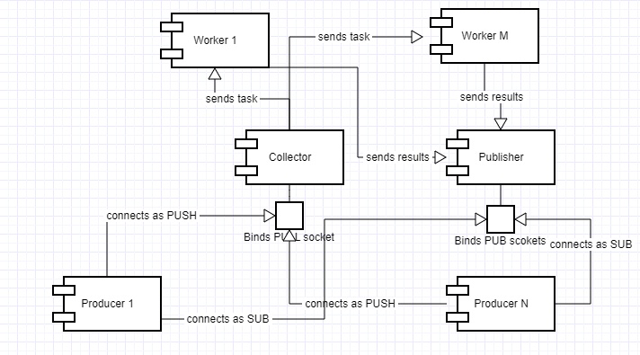

==================================================================
``pyzero-dtq``: a lightweight asynchronous distributed task queue
==================================================================

**Pyzero-dtq** is a lightweight asynchronous distributed task queue  and messaging library that uses ZeroMQ and some
Python stdlib libraries such Multiprocessing to fulfill its purpose. It is a replacement of use cases such
Celery + RabbitMQ when messaging and task distribution is required.

*Pyzero-dtq* is broken down in three main entities:

1.  **workers**: processes that carry out the work associated to certain tasks
2.  **collector**: process that collects the tasks to be run
3.  **publisher**: process that sends the results of applying the tasks back to the producers.

A set of producers send a series of tasks to the collector that will then distribute such tasks over some workers.
Workers in turn will run the received tasks and pass it to the publisher for this to send it back to the corresponding
producers. Producers therefore are external clients interacting with *Pyzero-dtq*.

Workers and Strategy Pattern
============================
Workers are just mere vehicles to be parallelise the execution of tasks to achieve the maximum throughput. They have
been implementing using the Strategy Pattern so that the execution of the task is delegated onto external dependency
injected at real time. The worker therefore does three operations:

1.  Fetch task from queue.
2.  Pass task to an external object.
3.  Block in the queue if this is empty.

Collector
=========
A collector is known endpoint by producers where the latter send the tasks they want to be accomplished. Then it adds
such tasks to a queue that is shared by all workers. The collector is the gateway between producers and workers.

Publisher
=========
The publisher is the process picking the results obtained from executing the tasks by the tandem worker-external object
and send it back to the corresponding publisher. Therefore a publisher does the following three operations:

1.  Fetch a result from a queue.
2.  Send the task to the corresponding producer.
3.  Block in the queue if this is empty.

Overall Communication Pattern
===============================
The communication between Pyzero-dtq and the outside world is governed by ZeroMq, which is a general-purpose lightweight
messaging library that can deliver messaging following many communication patterns. It uses non-blocking sockets with
associated queues where messages are stored and delivered asynchronously to the other end.

Pyzero-dtq uses two communication patterns in its exchange with producers as follows:

1.  **Push-Pull**: Pyzero-dtq listen for inbound tasks on a PULL socket that can only receive data downstream. Many
    producers can simultaneously send data via PUSH socket to the collector awaiting on a PULL end.
2.  **Pub-Sub**: contrary to the PULL end, Pyzero-dtq will send the results from tasks via PUB socket back to the
    corresponding producer who are now listening on a SUB socket.

Overall Working Model
=====================
When a producer is instantiated it subscribe to a topic under which all its tasks will be sent. A producer could
subscribe to many as many topics as wished. Tasks are then sent to the collector indicating the topic(s) and certain
data to be processed. The collector adds such task to a shared queue with workers that would have been blocked in the
queue when this was empty. The number of workers awaiting for completing tasks depends very much on the initial
configuration of Pyzero-dtq.

A first-in-first-serve policy aplies given the nature of the queue as data structure. The worker then pass the fetched
task to an external object that will carried out its execution. The result is given back to the worker who will place it
in another queue that shares with the publisher.

Lastly the publisher will fetch the results from the second queue and send it back to the corresponding producers who are
listening on a subscriber socket. The publisher knows what result is for what producer because the results are added
to the second queue along with the original topic received from the producer.

Figure 1 and 2 show Pyzero-dtq's component and communication diagram.

Figure 1: Pyzero-dtq components diagram

Figure 2: Pyzero-dtq communication diagram